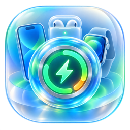
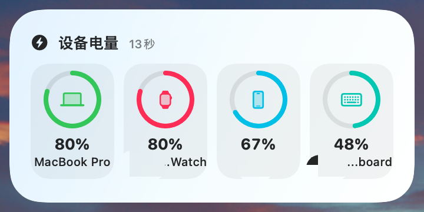
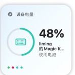
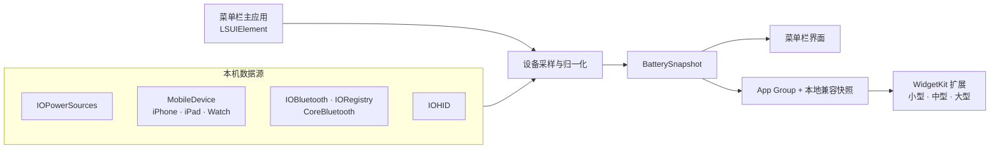

<div align="center">
  

  <h1>BatteryGlass</h1>

  <p><strong>一眼看清身边每台 Apple 设备的电量。</strong></p>
  <p>为 macOS 26 打造的原生菜单栏工具与桌面小组件。</p>

  <p>
    <a href="https://github.com/keepkeen/BatteryGlass/releases/latest"></a>
    <a href="https://github.com/keepkeen/BatteryGlass/releases"></a>
    <a href="https://github.com/keepkeen/BatteryGlass/blob/main/LICENSE"></a>
  </p>

  <p>
    
    
    
    
  </p>

  <p>
    <a href="#features">功能亮点</a> ·
    <a href="#quick-start">快速开始</a> ·
    <a href="#device-support">设备支持</a> ·
    <a href="#architecture">技术架构</a> ·
    <a href="#faq">常见问题</a> ·
    <a href="#contributing">参与贡献</a>
  </p>
</div>

<br>

<div align="center">
  
</div>

> [!NOTE]
> BatteryGlass 将 Mac、iPhone、iPad、Apple Watch、AirPods、Magic Keyboard、鼠标与其他蓝牙外设的电量收进同一个原生界面。数据只在本机采集与保存，不依赖云端服务，也不需要登录账户。

<a id="features"></a>

## ✨ 功能亮点

<table>
  <tr>
    <td width="50%" valign="top">
      <h3>🔋 一个菜单，所有设备</h3>
      <p>从菜单栏快速查看电量、充电状态、设备名称与连接信息。菜单栏数字会自动突出当前电量最低的未充电设备。</p>
    </td>
    <td width="50%" valign="top">
      <h3>🧊 原生 macOS 26 设计</h3>
      <p>使用 SwiftUI、WidgetKit、SF Symbols 与系统玻璃材质构建，自动适配浅色、深色、强调色和桌面背景。</p>
    </td>
  </tr>
  <tr>
    <td width="50%" valign="top">
      <h3>📱 三种桌面组件</h3>
      <p>小型聚焦最低电量设备；中型展示最多 4 台；大型以双栏布局展示最多 8 台设备。</p>
    </td>
    <td width="50%" valign="top">
      <h3>🛡️ 本地优先</h3>
      <p>没有账号、没有遥测、没有远程数据库。电量快照仅保存在本机，并通过本地容器交给 WidgetKit。</p>
    </td>
  </tr>
</table>

### 三种尺寸，各有重点

<table>
  <tr>
    <th align="center">小型 · 1 台</th>
    <th align="center">中型 · 最多 4 台</th>
  </tr>
  <tr>
    <td align="center" valign="middle"></td>
    <td align="center" valign="middle"></td>
  </tr>
  <tr>
    <td align="center">自动聚焦最低电量设备</td>
    <td align="center">横向概览常用设备</td>
  </tr>
</table>

<a id="quick-start"></a>

## 🚀 快速开始

### Homebrew 安装（推荐）

```bash
brew install --cask keepkeen/batteryglass/batteryglass
```

当前公开预览版采用本地签名，尚未经过 Apple Developer ID 公证。如果首次启动被 Gatekeeper 阻止，请仅对 BatteryGlass 清除隔离属性：

```bash
xattr -dr com.apple.quarantine /Applications/BatteryGlass.app
open -a BatteryGlass
```

> [!WARNING]
> 上面的 `xattr` 命令只应作用于 `/Applications/BatteryGlass.app`，不要对整个“应用程序”目录或其他路径执行递归清除。介意绕过 Gatekeeper 的用户可以选择[从源码构建](#build-from-source)。

### 手动安装

1. 前往 [Releases](https://github.com/keepkeen/BatteryGlass/releases/latest) 下载最新版 `BatteryGlass-*-macOS.zip`。
2. 解压并将 `BatteryGlass.app` 拖入“应用程序”文件夹。
3. 首次启动后，电池图标会出现在菜单栏。
4. 如遇 Gatekeeper 提示，使用上方针对单个 App 的命令，或在“系统设置 → 隐私与安全性”中选择“仍要打开”。

### 添加桌面小组件

1. 先启动一次 BatteryGlass，等待菜单栏完成首次刷新。
2. 右键点按桌面，选择“编辑小组件”。
3. 搜索 `BatteryGlass` 或“设备电量”。
4. 选择小型、中型或大型并添加到桌面。

更新后如果组件库仍显示旧尺寸，请移除旧组件后重新添加；macOS 会刷新 WidgetKit 的尺寸缓存。

<a id="device-support"></a>

## 🎛️ 设备支持

| 设备 | 数据来源 | 使用条件 |
| --- | --- | --- |
| MacBook 内置电池 | `IOPowerSources` | 无需额外设置 |
| iPhone / iPad / iPod | macOS `MobileDevice.framework` | 先在 Finder 中信任此 Mac；USB 或 Wi-Fi 可达 |
| Apple Watch | 已连接 iPhone 的 `companion_proxy` | 手表已与当前可读 iPhone 配对 |
| AirPods / Beats | IOBluetooth、IORegistry、系统设备信息与短时 BLE 扫描 | 设备已连接、开盖或处于系统可见状态 |
| Magic Keyboard / Mouse / Trackpad | 系统蓝牙与 IORegistry | 已连接到当前 Mac |
| 其他蓝牙外设 | Bluetooth Battery Service 与系统缓存 | 设备需要向 macOS 暴露电量 |
| 部分厂商 HID 鼠标 | IOHID | 仅此类适配可能需要“输入监控”权限 |

> [!TIP]
> AirPods 为节省电量不会持续广播。若暂时看不到耳机或充电盒电量，请开盖、佩戴或在系统蓝牙菜单中连接后，再点击 BatteryGlass 的刷新按钮。

## 🔐 权限与隐私

BatteryGlass 遵循“能不申请就不申请”的原则：

- **蓝牙**：仅用于发现附近配件和补齐 AirPods 等设备的电量。
- **输入监控**：只影响需要 IOHID 读取的少量已适配厂商鼠标；拒绝后不影响 Mac、移动设备和系统蓝牙设备。
- **移动设备信任**：由 Finder 管理，BatteryGlass 不接触 Apple ID 密码或设备解锁密码。
- **本地存储**：快照写入本机 App Group 与 Widget 兼容容器，不上传服务器。
- **网络**：核心采样流程不依赖互联网。

主应用未启用 App Sandbox，因为采样层需要访问系统设备信息、统一日志和运行时 MobileDevice 接口；Widget 扩展只读取本地快照，不直接执行设备扫描。

<a id="architecture"></a>

## 🏗️ 技术架构



设计原则很简单：**主应用负责采样，Widget 只负责展示**。这样既能对蓝牙扫描和私有接口调用进行统一节流，也避免桌面组件因系统运行预算受限而反复唤醒设备。

### 采样节奏

- 菜单栏主应用按节流策略刷新，不会持续进行 BLE 扫描。
- 用户点击刷新按钮时会触发一次主动更新。
- WidgetKit 读取最近快照，并由系统安排时间线刷新。
- 同一设备的多来源结果会先归一化、去重，再进入 UI。

### 项目结构

```text
BatteryGlass/
├── App/                 # 菜单栏主应用、设置与 macOS 26 UI
├── Widget/              # WidgetKit 小型 / 中型 / 大型组件
├── Shared/              # 采样器、设备模型、快照与共享存储
├── Tests/               # 快照与采样回归测试
├── ThirdParty/          # 第三方许可证和归属声明
└── BatteryGlass.xcworkspace
```

<a id="build-from-source"></a>

## 🧰 从源码构建

### 环境要求

- macOS 26 或更高版本
- Xcode 26
- Swift 6

```bash
git clone https://github.com/keepkeen/BatteryGlass.git
cd BatteryGlass
open BatteryGlass.xcworkspace
```

在 Xcode 中选择你的开发团队，并为主应用和 Widget 扩展注册相同的 App Group：

```text
group.com.liuliming.BatteryGlass
```

仅做无签名编译检查：

```bash
xcodebuild \
  -workspace BatteryGlass.xcworkspace \
  -scheme BatteryGlass \
  -configuration Debug \
  -derivedDataPath build/DerivedData \
  CODE_SIGNING_ALLOWED=NO \
  build
```

## ⚠️ 已知限制

- iPhone、iPad 与 Apple Watch 采样使用 macOS 自带但未公开的 MobileDevice 接口；Apple 可能在系统更新后改变其行为。
- Apple Watch 电量经已连接 iPhone 间接读取，不会直接连接手表。
- AirPods 和部分蓝牙设备只在连接、开盖或广播期间提供最新电量。
- 由于私有接口和本地系统信息采样方式，BatteryGlass 目前不适合上架 Mac App Store。
- v0.1.1 为本地签名预览版，尚未进行 Apple Developer ID 公证。

<a id="faq"></a>

## ❓ 常见问题

<details>
<summary><strong>组件库里找不到 BatteryGlass？</strong></summary>

先启动一次主应用并等待首次刷新，然后重新打开“编辑小组件”。如果刚升级版本，请移除旧组件后重新添加。仍未出现时，可退出并重新打开 BatteryGlass，让系统重新注册 Widget 扩展。

</details>

<details>
<summary><strong>发现了设备，但电量显示为“--”？</strong></summary>

这代表 macOS 能识别设备身份，但当前数据源没有提供有效电量。iPhone / iPad 请检查 Finder 信任状态；AirPods 请尝试开盖或重新连接；第三方蓝牙设备需要实现标准电量服务或向系统报告电量。

</details>

<details>
<summary><strong>为什么读取不到 Apple Watch？</strong></summary>

Watch 数据由已连接并受信任的 iPhone 转发。请确认手表已与该 iPhone 配对，并让 iPhone 通过 USB 或 Wi-Fi 对当前 Mac 可达。

</details>

<details>
<summary><strong>BatteryGlass 会上传设备信息吗？</strong></summary>

不会。当前版本没有云端账户、遥测服务或远程数据库；设备名称和电量快照只保存在本机。

</details>

## 🗺️ 路线图

- [x] macOS 26 原生菜单栏界面
- [x] 小型、中型与大型桌面组件
- [x] Mac、Apple 移动设备、AirPods 与蓝牙外设采样
- [x] Apple Silicon / Intel 通用构建
- [x] GitHub Release 与 Homebrew Cask 分发
- [ ] Developer ID 签名与 Apple 公证
- [ ] 可配置的低电量通知
- [ ] 更多第三方 HID 设备适配
- [ ] 更完整的自动化构建与发布流水线

<a id="contributing"></a>

## 🤝 参与贡献

欢迎提交 Bug、兼容性报告、设备样本与 Pull Request：

1. 先搜索现有 [Issues](https://github.com/keepkeen/BatteryGlass/issues)，避免重复。
2. 报告设备问题时，请写明 macOS 版本、设备型号、连接方式和是否已在 Finder 中信任。
3. 请勿在 Issue 中上传序列号、UDID、Apple ID、完整系统日志或其他敏感信息。
4. 修改采样层时，尽量补充对应回归测试，并保持失败时优雅降级。

## 🙏 致谢

BatteryGlass 的设备采样层改编自 Apache-2.0 许可的 MacTools DeviceBattery 插件。详细归属与原始许可见 [ThirdParty/NOTICE.md](ThirdParty/NOTICE.md) 和 [ThirdParty/MacTools-LICENSE](ThirdParty/MacTools-LICENSE)。

感谢所有愿意测试不同 Apple 设备、蓝牙配件与 macOS 版本的贡献者。

## 📄 许可证

BatteryGlass 基于 [Apache License 2.0](LICENSE) 开源。该许可证允许个人和商业使用、修改与分发，并包含明确的专利授权条款。

---

<div align="center">
  <p><strong>让电量留在视线里，而不是藏在设置里。</strong></p>
  <p>
    如果 BatteryGlass 对你有帮助，欢迎点亮 ⭐ Star，或把它分享给同样拥有一桌 Apple 设备的朋友。
  </p>
  <p>
    <a href="https://github.com/keepkeen/BatteryGlass/releases/latest">下载最新版</a> ·
    <a href="https://github.com/keepkeen/BatteryGlass/issues/new">报告问题</a> ·
    <a href="https://github.com/keepkeen/BatteryGlass">查看源码</a>
  </p>
</div>
